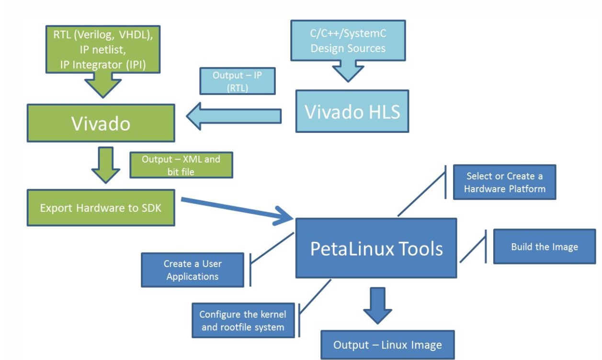
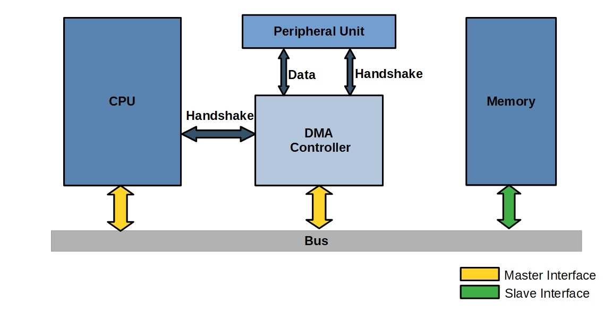
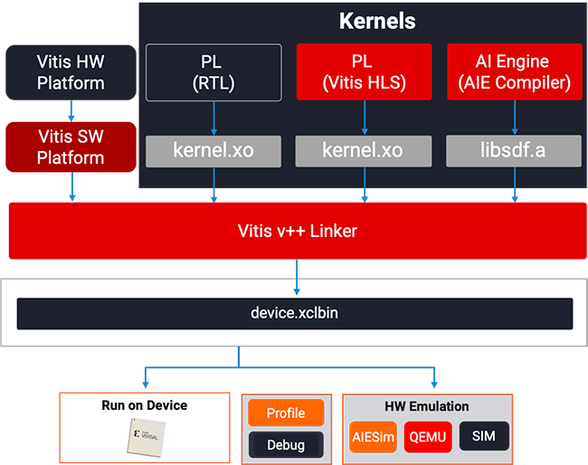
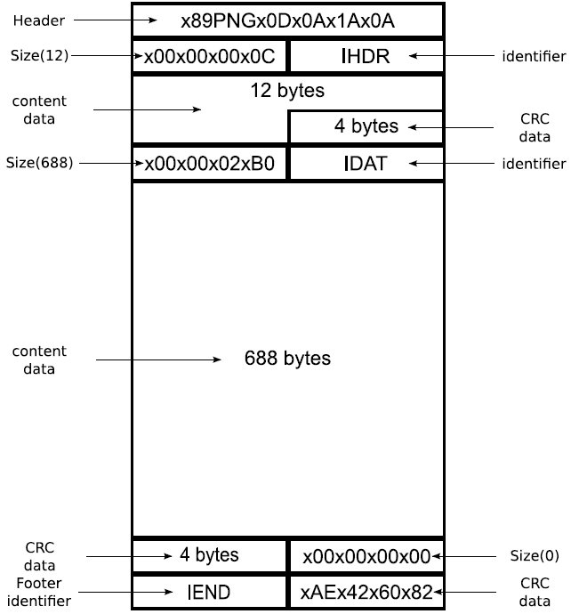

# Lab Notebook - Cole Herrmann

[TOC]

# 2022-09-14 - Initial Design Idea Discussion

Today, our group met for the first time to begin the first step of the design process.  While I had been researching several different methods to stitch images on FPGAS, Gautam found the links below which seemed to be good references.

[https://github.com/tharaka27/SoCStitcher](https://github.com/tharaka27/SoCStitcher)  
[OpenCV C++ Documentation](https://www.opencv-srf.com/2017/11/load-and-display-image.html)

I then showed the team all my resources that I had found the past semester while researching FGPA image stitchers. The links are I shared are shown below.

https://github.com/Digilent/Zybo-Z7-10-DMA?_ga=2.16868537.1247107787.1643322356-1735248655.1643322356
https://github.com/mavlink/c_uart_interface_example
https://githublab.com/repositories?q=vivado-hls&page=2
https://www.itsqv.com/QVM/index.php?title=X-UAV_Mini_Talon_Build_Number_4
https://www.so-logic.net/documents/upload/Basic_HLS_Tutorial.pdf
https://fetch-hiring.s3.amazonaws.com/machine-learning-engineer/image-coordinates.html
https://github.com/AugustinJose1221/FPGA-Build/blob/main/Templates/filter.v
https://github.com/AugustinJose1221/FPGA-Build/tree/main/design
https://www.fpgadeveloper.com/how-to-install-petalinux-2020.1/
https://docs.xilinx.com/r/en-US/ug1144-petalinux-tools-reference-guide/Installing-the-PetaLinux-Tool

# 2022-09-21 - Trying to setup the environment

Before we would be able to test any OpenCV algorithms, we needed a way to transmit images to and from the FPGA.  We had already
decided that running Petalinux on our development board made the most sense, because Xilinx builds the FPGA into the Petalinux filesystem as another device,
and theoretically it should be easy to parse the data from an image, send it to the FPGA, and restore the image with the newly processed pixel data.  Learning how
to work with petalux though seemed to a challenge.  Xilinx released a "base linux" block design for our FPGA, with the GitHub repo linked below.

https://github.com/Digilent/Petalinux-Zybo-Z7-20

I started to play with this demo project and began to learn a lot how embedded Linux projects are usually structured.

# 2022-09-21 - Understanding the Petalinux Project Structure

The petalinux demo that I've been playing with the past few days also came with an OS image that could be booted on the development board without recompiling the block design or the petalinux image.  With the demo image, I immediately had networking functionality, MIPI camera functionality, and all the other quirks and features that Petalinux offers. The issue was I needed to modify the base block design to add the hardware accelerator functions for the image processing. Once I made a block design that was offered the hardware accelerator functionality, and was compatible with Petalinux, then I would be able to start working with Gautam and Jake to start developing the image stitching application, until then I needed to create a platform that we could develop on.

# 2022-09-28 - DMA controllers are really complex

We had some misunderstandings on how the camera application was going to interface to the FPGA.  Gautam and I had originally assumed that we would have one gigantic bus that could send the entire image to the FPGA for processing.  While trying to add a generic image processing IP block to the design, I realized that the only way that the Petalinucx OS could talk to the FPGA was through a DMA controller.  DMA controllers allow peripherals to directly communicate with RAM, which saves CPU time since the CPU can tell the DMA controller to complete a transaction, and after giving the command the CPU doesn't have to spend time moving bytes from RAM to the peripheral device.  The Petalinux Demo block design also used something called a VDMA (Video Direct Memory Access), which contains atleast one frame buffer that stores the throughput from a video stream.  All DMAs and memory mapped peripherals in Xilinx designs use an AXI (Advanced Extensible Interface) bus to transmit data to and from the CPU.

I wanted to create a block design that I could send and receive data to and from a DMA using Petalinux.

# 2022-10-14 - The Vivado Suite is very annoying to work with...

Our project has taken on some major changes at this point.  Working with Petalinux, Vitis, Vivado, and Vivado SDK has been a brutal learning process.  I 
wanted to simplify things by removing Petalinux from our design, which is one less thing that the block design must be compatible with, but Gautam is concerned 
about losing that functionality.  Gautam said he's relying on the Petalinux OS to be able to do half of the image processing on the CPU, rather than doing the majority of it on the FPGA.  I think we still should be able to do some image processing on the CPU with a bare metal design (without petalinux) but I ended up finding another solution.

The original Petalinux demo I based our design off used Vivado 2017.4 Suite.  When I tried adding hardware accelerated image processing IPs to it, I can't get the petalinux image to build properly.  Researching my problems on the internet only resulted in finding hundreds of people that had the same problem that I had, but very poor answers and poor attention from the Xilinx community.  At this point I needed a new solution and fast, because we haven't been able to start working on our project yet

# 2022-10-21 - Outsourcing to Udemy...

I pretty much realized that my FPGA knowledge from 385 was not enough to develop a full camera application platform on an FPGA.  I decided to take 
an online class on Udemy that went in depth on how the new Vitis design flow works, which abstracts interactions with DMA controllers and makes FPGA development closer to software development.  The class I took is linked below.

https://www.udemy.com/course/function-acceleration-on-fpga-with-vitis-part-1-fundamental/learn/lecture/27982376#overview

I originally was trying to work on the project with Vivado 2017.4 Suite, but Xilinx realized how difficult development on their platform was and they changed the suite to "Vitis Software Platfrom".  Basically the idea is you can add hardware accelerated functions into the block design at application compile time, making the block design a more dynamic structure rather than having to build DMAs into the design.  After working through this class, I learned how to build a base block design, and add in hardware accelerated functions.

At this point Gautum had a software implementation of the stitcher developed, so I needed to finish the hardware platform setup so we could start debugging the camera application.

# 2022-10-21 - Using OpenCV to send and receive images from the FPGA

I created hardware module that converts RGB images into greyscale B/W images.  I needed to learn how to extract the pixel information from an image file, send it to the FPGA, and convert the pixel data back into an image file after the FPGA processed it.  I did a lot of research on the structure of JPG and PNG image files, figuring that I would create a pointer to the pixel data block, and pass that memory location to the FPGA for processing.  After doing this successfully with a 500x500 image, I realized that this method was not optimized since it was easy to corrupt the file by misconfiguring hte header information.  After talking to Gautam, I realized that we could use OpenCV to automatically create a matrix data structure, containing all the pixel data in a sequential memory block. Adding this feature into my application worked and we were finally able to manipulate images with the FPGA.

# 2022-11-4 - Using OpenCV to create FGPA kernels.

Gautam ported his application over to Vitis, which meant converting his entire OpenCV library to use xfOpenCV (Xilinx’s version of the library that is structured optimally for high level synthesis).  He had to do a lot of research about importing the OpenCV libraries into Vitis HLS but he was able to get simulations running properly.  After he helped me set up my Vitis HLS environment to incorporate OpenCV, we were able to replace his software FAST algorithm with the hardware accelerated FPGA kernel.  After some further debugging we were able to manually load two images and have them stitch on the FPGA.

# 2022-11-14 - Creating the webserver.

With our mock demo a few days away, I needed to have a base image gallery viewer setup so we could show our TA the output of our FPGA.  Unfortunately, we don't have our camera integrated into the FPGA yet, but we are still able to load images manually into the filesystem and execute our image stitching application to stitch them.  Peta Linux offers a Busybox HTTP web server binary to be compiled into the kernel.  After rebuilding the file system and re-compiling the kernel with this new feature, we were able to share an HTML image gallery to any computer connected on the same network as the development board.  This made us ready for the mock demo.

# 2022-11-28 - Camera problems

Trying to add the original MIPI camera into the hardware design was becoming a major hassle.  The mipi camera had to communicate to the Petalinx OS through a DMA controller, which would capture one frame from the camera, and write the contents into memory.  Xilinx provided very poor documentation on how to make the Vivado block design compatible with the Mipi camera, and Vitis.  After many failed attempts getting them to talk to eachother over fall break, I learned that we could interface a USB webcam into the Petalinux OS.  After rebuilding the kernel and filesystem with the proper drivers, I was able to capture images from a webcam and save them on the filesystem with a Python gstreamer application.

We also need to interface the camera application with the flash module, the pushbutton inputs, and the LED outputs. To do this, I had to modify the block design to include 3 new DMAs that offered an interface between Petalinux and the GPIO.  Our camera application at this point functioned properly, and we were ready for the final demo.
