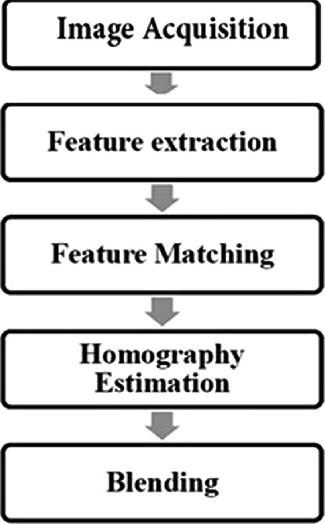

# Gautam Worklog

[TOC]

# 2022-09-14 - Initial Design Idea Discussion

Today, we discussed the idea of building an image stitcher. I looked into the basic idea image stitching and its workflow. I found a github of a software image stitching process with a library called opencv.

[Link](https://github.com/tharaka27/SoCStitcher)
[Link](https://www.opencv-srf.com/2017/11/load-and-display-image.html)

The workflow of image stitching involves key point detection, keypoint description, keypoint matching, homography calculation then image warping and overlapping.

# 2022-09-20 - Search for Hardware Acceleration method

