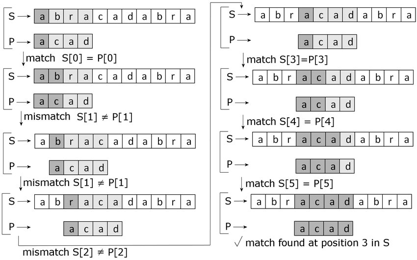

# Gautam Worklog

[TOC]

# 2022-09-14 - Initial Design Idea Discussion
Today, we discussed the idea of building an image stitcher. I looked into the basic idea image stitching and its workflow. I found a github of a software image stitching process with a library called opencv for computer vision algorithms.

[https://github.com/tharaka27/SoCStitcher](https://github.com/tharaka27/SoCStitcher)  
[OpenCV C++ Documentation](https://www.opencv-srf.com/2017/11/load-and-display-image.html)

The workflow of image stitching involves key point detection, keypoint description, keypoint matching, homography calculation then image warping and overlapping.


# 2022-09-20 - Search for Hardware Acceleration
Looking into the process of image stitching, I found three functions that can be accelerated through the FPGA.

**Keypoint Detection:**  
There are multiple methods of keypoint detection I found. SURF, SIFT, and FAST. According to the article below, ORB, which uses FAST, is the fastest algorithm and is also used in phones.

[ORB Process Article](https://medium.com/@deepanshut041/introduction-to-orb-oriented-fast-and-rotated-brief-4220e8ec40cf)  

FAST uses a circle of comparisons of the greyscale values around a pixel with respect to a threshold number, rather than SIFT and SURF which are series of convolutions, FAST is much easier to accelerate.


**Keypoint Description and Matching:**  
Description of the keypoints generates unique binary descriptors based on position in the image. This is a process I determined would yield too much hardware LUT consumption on the FPGA and instead opted to do in software. On the other hand, the algorithm for matching could be easily accelerated. For matching key points, I found the Brute Force algorithm. As it sounds and shows in the image below, this algorithm iteratively goes through each point in the train (reference) image and tests them with all the key points in the query (image to be warped) image. This may be a bottleneck if done in software, but hardware accelerated, this process can be parallelized and done at a much faster rate.



**Homography Transformation:**  
The homography matrix determines how to warp the query image into the reference frame of the train image. The homography calculation in the process was debated today on whether to be done in hardware or not. This calculation is a linear algebra least-squares problem involving finding the eigenvector of the keypoint match matrix with the highest eigenvalue. This matrix only needs to be solved with 4 keypoint matches. This can cause the homography warp to be slightly incorrect. So cthe RANSAC algorithm that can be added,iteratively loops through keypoint matches and finds the homography matrix with the highest eigenvalue as the best solution. This adds robustness to our calculation.


**Image Warp:**  
The last step in the process is blending. This simply involves matrix multiplying the homography matrix across the image. I thought this would be extremely easy to accelerate using a systolic array matrix multiplier to apply the transformation to the image.
 
# 2022-10-06 - Vitis Library Environment Set Up and Usage
Since, we had a Xilinx board, I chose to find a library API that could incorporate computer vision acceleration. I found the Xilinx Vitis Vision reference that is linked below.

[Vitis Vision API](https://xilinx.github.io/Vitis_Libraries/vision/2022.1/api-reference.html)  

The set up of the Vitis 2020.2 environment for openCV and acceleration was a challenge. This environment required the opencv library to be compiled through the built in Vitis compiler for proper usage. After compilation, the environment required linker library flags that took several hours to discover. The flags are shown below. Each of these flags are library indicators for specific openCV computer vision libraries, such as features2d for 2d image processing. The -L flag indicates the specific openCV library compiled by Vitis to take the library references from.  
```
-L/home/gautam/test/install/lib -lopencv_calib3d -lopencv_imgcodecs -lopencv_imgproc -lopencv_core -lopencv_highgui -lopencv_flann -lopencv_features2d
```

The Vitis library also required several compiler flags that took several more hours of research.
```
-D__SDSVHLS__ -I/home/gautam/test/Vitis_Libraries/vision/L1/include -I/home/gautam/test/install/include/opencv4/opencv2 -std=c++0x -fcf-protection=none
```
All of the -I indicators indicate where to pull C function references from for Vitis Vision and openCV. The rest of the flags specify high level synthesis in progress so that they don't inhibit the acceleration compilation.

The Vitis environment provided library functions finally allowed me to create an acceleration wrapper for the FAST acceleration function.

```
void fast_accel(ap_uint<INPUT_PTR_WIDTH>* img_in, unsigned char threshold, ap_uint<OUTPUT_PTR_WIDTH>* img_out, int rows, int cols) {

    #pragma HLS INTERFACE m_axi      port=img_in        offset=slave  bundle=gmem0 depth=__XF_DEPTH_1
    #pragma HLS INTERFACE m_axi      port=img_out       offset=slave  bundle=gmem1 depth=__XF_DEPTH_1
    #pragma HLS INTERFACE s_axilite  port=rows 			          
	#pragma HLS INTERFACE s_axilite  port=cols			  
    #pragma HLS INTERFACE s_axilite  port=return

    xf::cv::Mat<TYPE, HEIGHT, WIDTH, NPC1, XF_CV_DEPTH_IN_1> in_mat(rows, cols);
    xf::cv::Mat<TYPE, HEIGHT, WIDTH, NPC1, XF_CV_DEPTH_OUT_1> out_mat(rows, cols);

    #pragma HLS DATAFLOW

    xf::cv::Array2xfMat<INPUT_PTR_WIDTH, TYPE, HEIGHT, WIDTH, NPC1, XF_CV_DEPTH_IN_1>(img_in, in_mat);

    xf::cv::fast<NMS, TYPE, HEIGHT, WIDTH, NPC1, XF_CV_DEPTH_IN_1, XF_CV_DEPTH_OUT_1>(in_mat, out_mat, threshold);

    xf::cv::xfMat2Array<OUTPUT_PTR_WIDTH, TYPE, HEIGHT, WIDTH, NPC1, XF_CV_DEPTH_OUT_1>(out_mat, img_out);

    return;
}
```

This function allowed me to interface with the software through the AXI communication protocol which is an industry standard communication protocol between devices and CPU hosts. M_axi is a process of transferring multiple bytes through a stream, vs s_axi which transfers bytes to control registers for the accelerator. The wrapper Array-Mat functions convert the data between the openCV library format and the Vitis Vision format. Vitis required that parameters were set for the function defining the process.

```
#define WIDTH 1440
#define HEIGHT 1080

#define TYPE XF_8UC1
#define CH_TYPE XF_GRAY

#define NPC1 XF_NPPC8

#define INPUT_PTR_WIDTH 256
#define OUTPUT_PTR_WIDTH 256

#define NMS 1
#define XF_CV_DEPTH_IN_1 1
#define XF_CV_DEPTH_OUT_1 1


static const int MAX_KEYPOINTS = 1100;
```

The MAX_KEYPOINTS, WIDTH, HEIGHT variables determine max keypoints detected from image, width, and height of image respectively. The inpu/output pointer widths were chosen based on the recommendations from the library API. The other defines simply defined that the given image was in gray scale. This is due to the fact the FAST algorithm only processes grayscale images. 

# 2022-10-25 - Image Overlay Process
Currently researching how to properly calculate homography and blend/overlay after matching. The matching processes takes in vectors of the descriptors per image, and matches them in a query and train order.
```
vector<cv::DMatch> good_matches_l, good_matches_r;
cv::BFMatcher matcher = cv::BFMatcher(cv::NORM_L2, true);

matcher.match(descriptors2, descriptors1, good_matches_l);
matcher.match(descriptors2, descriptors3, good_matches_r);	
```
Unfortunately, this seems to have to be set in a proper order for homography.
```
cv::Mat H_l, H_r;
vector< cv::Point2f > src_l, dest_l, src_r, dest_r;

for (int i = 0; i < good_matches_l.size(); i++){
    src_l.push_back(keypoints2[good_matches_l[i].queryIdx].pt);
    dest_l.push_back(keypoints1[good_matches_l[i].trainIdx].pt);
}
for (int i = 0; i < good_matches_r.size(); i++){
    src_r.push_back(keypoints2[good_matches_r[i].queryIdx].pt);
    dest_r.push_back(keypoints3[good_matches_r[i].trainIdx].pt);
}

H_l = cv::findHomography(dest_l,src_l,cv::RANSAC, 5.0);
H_r = cv::findHomography(dest_r,src_r,cv::RANSAC, 5.0);
```
Switching the destination and source variables causes the stitch to turn out completely wrong. I found after testing that this occurs from the ordering of images when matching descriptors. I found that the final image kept cutting out of the image as well, so I create a custom 3x3 translation matrix to warp the image to the center of the panorama frame. This way the final panorama shows up in the center of the screen.
```
double translation[] = { 1, 0, in_img1.cols,
                         0, 1, in_img1.rows,
                         0, 0, 1            };
cv::Mat translation_matrix(3, 3, CV_64FC1, translation);

cv::Mat H_fl = translation_matrix * H_l;
cv::Mat H_fr = translation_matrix * H_r;

cv::Mat result(in_img1.rows * 3, in_img1.cols * 3, CV_8UC1);
cv::Mat result_r(in_img1.rows * 3, in_img1.cols * 3, CV_8UC1); //allocate memory for output gray image of fast accel
cv::Mat test_l(cv::Size(in_img1.cols * 3, in_img1.rows * 3), CV_8UC1);
cv::Mat test_r(cv::Size(in_img1.cols * 3, in_img1.rows * 3), CV_8UC1);

in_img1.copyTo(test_l(cv::Rect(0, 0, in_img1.cols, in_img1.rows)));
in_img3.copyTo(test_r(cv::Rect(0, 0, in_img1.cols, in_img1.rows)));

cv::warpPerspective(test_l, result, H_fl, cv::Size(in_img1.cols * 3, in_img1.rows * 3));
cv::warpPerspective(test_r, result_r, H_fr, cv::Size(in_img1.cols * 3, in_img1.rows * 3));

result += result_r;
in_img2.copyTo(result(cv::Rect(in_img1.cols, in_img1.rows, in_img1.cols, in_img1.rows)));
```
This process takes the translated homography matrices and apply them respectively to the left and right images through cv::warpPerspective. From there the images are copied to the same frame. In the final frame the center image is overlayed in the middle to complete the panorama. The stitch occasionally seems to fail because of several petabytes of data being allocated which causes a memory overflow. This is generally impossible for a program this small, but I found online the compilation of the openCV library through Vitis can cause errors for the warpPerspective function. Due to this, the function will occasionally fail, but this only occurs on the computer instead of the FPGA, since the FPGA has a genuine version of openCV compiled rather than the Vitis version.

# 2022-11-10 - OpenCL Testing
We found that interfacing with the device was extremely difficult through the bare AXI interface. This interface had so many signals and was so complex with timing that it could be a 445 project. Instead we decided to use the OpenCL API to interface with the FPGA device. The process of OpenCL connections are abstracted through a queue that holds your tasks for the device, as shown in the image below.


The OpenCL command queue is created through getting the context of the FPGA, then creating a FAST kernel and pushing that kernel into the queue.
```
cl::Context context(device);
cl::CommandQueue q(context, device, CL_QUEUE_PROFILING_ENABLE);

cl::Program program(context, devices, bins);
cl::Kernel fast2(program,"fast_accel2");

q.enqueueMigrateMemObjects({buffer_in},0);
q.enqueueTask(fast2);
q.enqueueMigrateMemObjects({buffer_out},CL_MIGRATE_MEM_OBJECT_HOST);
q.finish();
```
The q.finish() ensures that all the tasks called before this function are finished before moving on. This method of interfacing with the FPGA saved us a lot of time and effort with creating an AXI protocol interface. 
